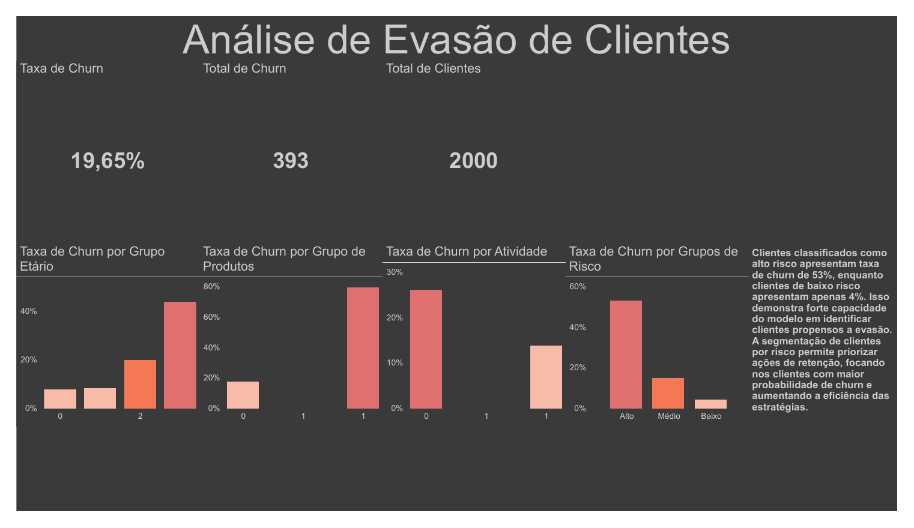

# Bank Churn Prediction & Analysis 📊🏦

Identificação dos principais fatores de evasão (churn) de clientes bancários,
com um modelo preditivo e um dashboard executivo em Power BI para priorizar
ações de retenção.



## 📌 Contexto e pergunta de negócio
Retenção é um dos maiores desafios de instituições financeiras. O objetivo é
**prever quais clientes têm maior risco de sair** e entender **o que mais explica
a evasão**, para que a equipe de negócio atue de forma proativa.

## 🧱 Pipeline
1. **EDA** (`notebooks/01_eda.ipynb`) — perfil dos clientes e padrões de churn
2. **Feature engineering** (`notebooks/02_feature_engineering.ipynb`) — variáveis de risco
3. **Modelagem** (`notebooks/03_model.ipynb`) — treino, avaliação e threshold tuning
4. **Dashboard** (`churn.pbix`) — KPIs executivos em Power BI

## 📈 Principais achados
Base de **2.000 clientes**, **393 evasões** (churn global de **19,65%**).

- **Segmentação por risco é altamente preditiva:** grupo de **alto risco tem 53%
  de churn** vs. **4%** no baixo risco.
- **Atividade importa:** clientes inativos evadem muito mais.
- **Idade e mix de produtos** revelam perfis específicos mais propensos ao cancelamento.

## 🤖 Modelo
- **Algoritmos:** Random Forest e Logistic Regression
- **ROC AUC: 0,84**
- **Desafio honesto — classe desbalanceada:** recall da classe "churn" é baixo no
  threshold padrão (0,5). Apliquei **threshold tuning** para trocar precisão por
  recall conforme o custo de negócio (ex.: threshold 0,3 → recall ~0,64).

> Em retenção, perder um cliente que ia evadir (falso negativo) costuma custar
> mais que abordar um que ficaria — por isso priorizar **recall** faz sentido aqui.

## 🛠️ Stack
Python · Pandas · scikit-learn · Power BI

## ▶️ Como rodar
```bash
git clone git@github.com:ReCroffi/bank-churn-prediction.git
cd bank-churn-prediction
pip install -r requirements.txt        # se não houver, instale pandas scikit-learn jupyter
jupyter notebook notebooks/01_eda.ipynb
# Dashboard: abra churn.pbix no Power BI Desktop
```

## 🗂️ Estrutura
```
bank-churn-prediction/
├── notebooks/   # 01_eda, 02_feature_engineering, 03_model
├── data/        # raw e processed
├── churn.pbix   # dashboard Power BI
└── dashboard.png
```

## 🔗 Dataset
[Bank Customer Churn — Kaggle](https://www.kaggle.com/datasets/gauravtopre/bank-customer-churn-dataset)
